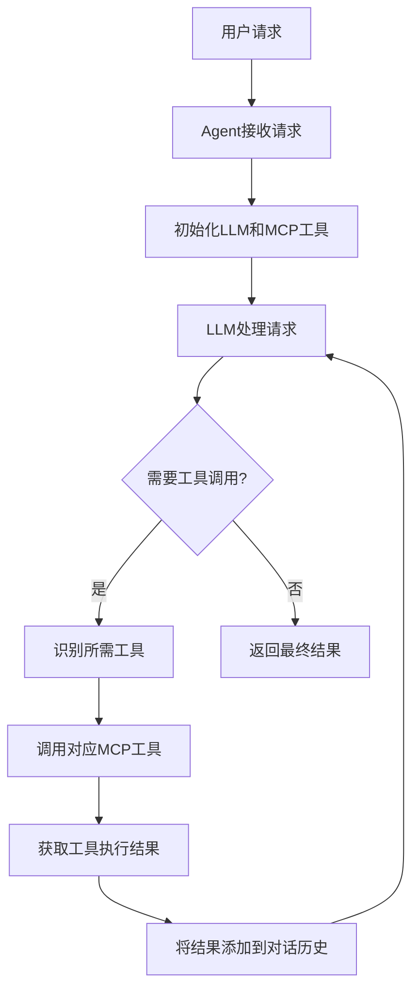

# LLM-MCP-RAG 项目

这是一个基于大语言模型（LLM）、Model Context Protocol（MCP）和检索增强生成（RAG）技术的智能代理系统。该项目整合了多种工具和服务，能够执行复杂的任务，如网络数据获取、文件操作以及基于知识库的问答。

## 项目概述

本项目实现了一个智能代理(Agent)，可以与多种工具进行交互，包括文件系统操作工具和网络请求工具。通过集成RAG技术，代理可以从知识库中检索相关信息，并结合这些信息生成更准确的回答。

## 核心组件

### 1. Agent.py
主要的代理类，负责协调各种MCP客户端和大语言模型(LLM)之间的交互。
- 初始化并管理多个MCP客户端
- 处理LLM返回的工具调用请求
- 协调工具执行和结果收集

### 2. MCPClient.py
MCP客户端实现，用于连接和通信各种MCP服务器。
- 支持连接多种MCP服务器
- 提供工具列表获取和工具调用功能

### 3. ChatOpenai.py
自定义的OpenAI聊天接口封装。
- 支持流式响应
- 工具调用处理
- 对话历史管理

### 4. EmbeddingRetriever.py
嵌入模型和向量检索实现。
- 文档嵌入向量化
- 相似性检索
- 与VectorStore集成

### 5. VectorStore.py
简单的向量存储和检索系统。
- 向量相似度计算
- 文档存储和检索

### 6. Util.py
工具函数集合。
- 控制台日志输出美化

## 主要特性

1. **多工具支持**: 通过MCP协议连接多种工具服务器
   - 文件系统操作工具
   - 网络请求(fetch)工具

2. **RAG能力**: 结合嵌入模型和向量数据库实现检索增强生成
   - 知识库文档向量化
   - 相似性检索
   - 上下文增强

3. **智能代理**: 自主决定何时及如何使用工具
   - 解析LLM工具调用请求
   - 执行相应工具并返回结果
   - 循环处理直到任务完成

## 工作流程



## 知识库

项目中的[knowledge](src/knowledge)目录包含了从JSONPlaceholder API获取的用户数据，用于演示RAG功能。这些数据被处理成多个Markdown文件，每个用户一个文件。

## 使用方法

1. 配置环境变量:
   - OPENAI_API_KEY: LLM API密钥
   - OPENAI_BASE_URL: LLM API基础URL
   - EMBEDDING_BASE_URL: 嵌入模型API基础URL
   - EMBEDDING_KEY: 嵌入模型API密钥
   - EMBEDDING_MODEL_NAME: 嵌入模型名称

2. 安装依赖:
   ```bash
   pip install -r requirements.txt
   ```

3. 运行主程序:
   ```bash
   python src/main.py
   ```

## 示例用例

1. 从网络获取信息并保存到文件
2. 基于知识库内容创作故事
3. 文件系统操作

## 技术栈

- Python 3.x
- OpenAI API
- Model Context Protocol (MCP)
- 向量数据库 (numpy实现)
- Rich (终端美化)

## 项目结构

```
llm-mcp-rag/
├── src/
│   ├── knowledge/         # 知识库文件
│   ├── Agent.py           # 智能代理主类
│   ├── ChatOpenai.py      # OpenAI接口封装
│   ├── EmbeddingRetriever.py # 嵌入模型检索器
│   ├── MCPClient.py       # MCP客户端
│   ├── Util.py            # 工具函数
│   ├── VectorStore.py     # 向量存储
│   ├── fetch.md           # fetch工具示例结果
│   ├── fetch_user.md      # 用户数据获取总结
│   └── main.py            # 主程序入口
├── .env                   # 环境变量配置
├── package.json           # Node.js依赖配置(MCP工具)
└── README.md              # 项目说明文档
```