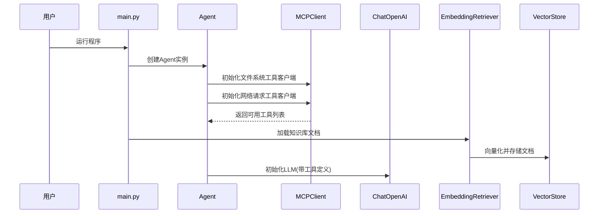
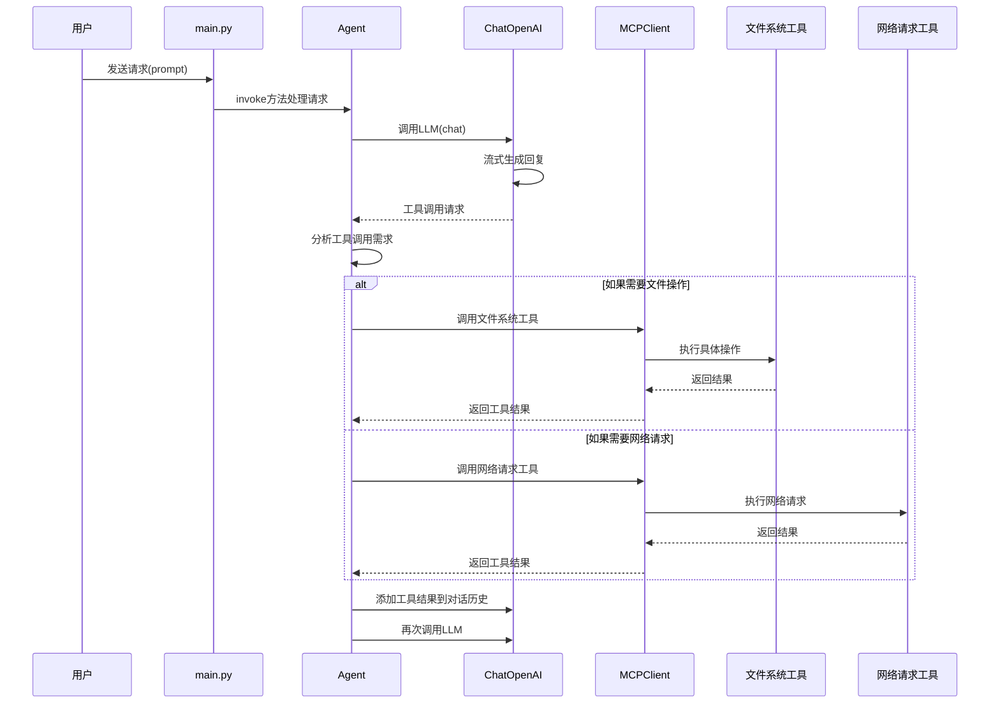
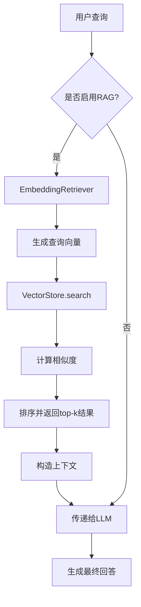

# 项目架构与工作流程

## 整体架构图

```mermaid
graph TB
    subgraph "外部服务"
        A[LLM服务] 
        B[嵌入模型服务]
        C[互联网]
    end

    subgraph "核心系统"
        D[Agent.py<br/>智能代理]
        E[MCPClient.py<br/>MCP客户端]
        F[ChatOpenai.py<br/>LLM接口]
        G[EmbeddingRetriever.py<br/>嵌入检索器]
        H[VectorStore.py<br/>向量存储]
    end

    subgraph "工具服务器"
        I[文件系统工具<br/>@modelcontextprotocol/server-filesystem]
        J[网络请求工具<br/>mcp-server-fetch]
    end

    subgraph "数据存储"
        K[knowledge目录<br/>Markdown文件]
        L[向量数据<br/>内存存储]
    end

    A -- "API调用" --> F
    B -- "API调用" --> G
    C -- "HTTP请求" --> J
    
    D -- "协调" --> E
    D -- "调用" --> F
    D -- "检索" --> G
    
    E -- "连接" --> I
    E -- "连接" --> J
    
    F -- "工具调用请求" --> D
    G -- "向量操作" --> H
    H -- "相似度计算" --> G
    
    I -- "文件操作" --> K
    J -- "网络数据" --> D
    K -- "文档读取" --> G
    L -- "向量存储" --> H
```

## 工作流程详解

### 1. 初始化阶段



### 2. 请求处理阶段



### 3. RAG检索流程



## 组件交互关系

### Agent 与 MCPClient
Agent负责管理多个MCPClient实例，每个MCPClient连接到不同的工具服务器。当Agent收到LLM的工具调用请求时，会遍历所有MCPClient查找匹配的工具并执行。

### ChatOpenAI 与工具调用
ChatOpenAI封装了与LLM的交互过程，支持流式输出和工具调用。当LLM决定使用工具时，会在响应中包含工具调用信息，Agent会捕获这些信息并执行相应的工具。

### EmbeddingRetriever 与 VectorStore
EmbeddingRetriever负责将文本转换为向量表示，并利用VectorStore进行相似性检索。VectorStore实现了基本的向量运算和存储功能。

### 数据流向
1. 用户输入 → Agent → LLM
2. LLM工具调用 → Agent → MCP工具 → 工具服务器
3. 工具执行结果 → Agent → LLM
4. 知识库文档 → EmbeddingRetriever → VectorStore
5. 查询请求 → EmbeddingRetriever → VectorStore → 相关文档 → LLM

这个架构使得系统具有高度的模块化和可扩展性，可以轻松添加新的工具或替换现有组件。