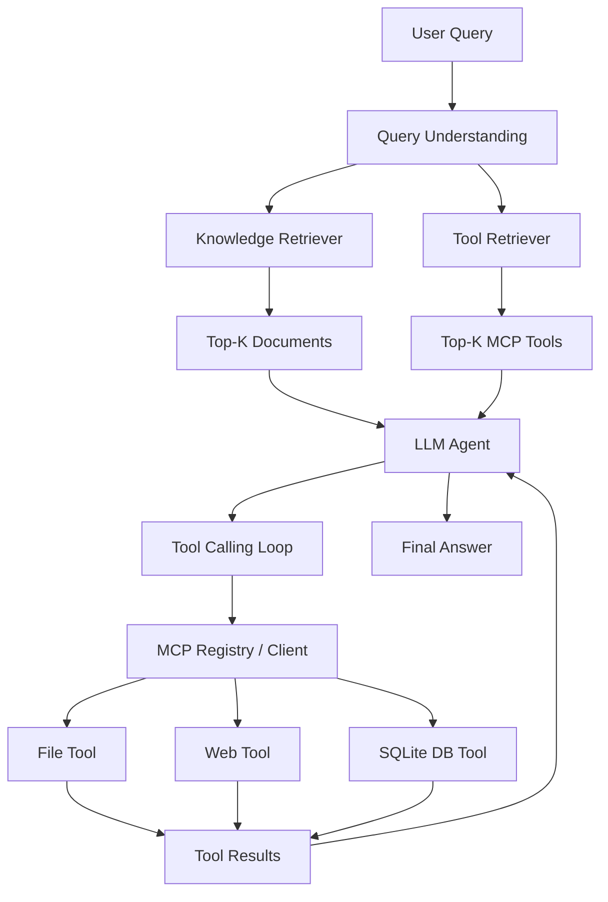

# MCP-RAG Agent V2 Architecture


```mermaid
graph TD
    U[User Query] --> Q[Query Understanding]
    Q --> KR[Knowledge Retriever]
    Q --> TR[Tool Retriever]
    KR --> KD[Top-K Documents]
    TR --> KT[Top-K MCP Tools]
    KD --> A[LLM Agent]
    KT --> A
    A --> TC[Tool Calling Loop]
    TC --> MC[MCP Registry / Client]
    MC --> F[File Tool]
    MC --> W[Web Tool]
    MC --> D[SQLite DB Tool]
    F --> R[Tool Results]
    W --> R
    D --> R
    R --> A
    A --> OUT[Final Answer]
```

## Design changes from V1

1. **Dual retrieval**: knowledge and MCP tools are independently embedded and retrieved. The LLM only sees the relevant Top-K tools rather than every available MCP tool.
2. **Tool registry**: every tool receives a qualified name (`server__tool`) so same-name tools from different servers cannot collide.
3. **MCP v2 client**: uses the official high-level `Client` API instead of manually managing `ClientSession.initialize()`. This matches the current stable MCP Python SDK line.
4. **Async I/O**: LLM and embedding calls use `AsyncOpenAI`; MCP lifecycle and tool calls are also asynchronous.
5. **Chunked knowledge**: Markdown is split into bounded chunks before embedding instead of embedding an entire file as one vector.
6. **Vector search correctness**: cosine similarity is calculated for every item, then globally sorted before Top-K truncation.
7. **Index cache**: knowledge/tool embeddings are cached and invalidated by document/tool fingerprints or embedding-model changes.
8. **Safe DB tool**: the local SQLite MCP server opens the database read-only and rejects mutating/multi-statement SQL.
9. **Runtime trace**: query, retrieval, LLM rounds, and tool calls receive a trace ID and duration metadata.
10. **Failure isolation**: optional MCP servers can fail without preventing the application from starting; required servers still fail fast.

## Runtime flow

### Query understanding

The router converts one user query into two semantic retrieval queries and two feature flags:

- `knowledge_query`
- `tool_query`
- `needs_knowledge`
- `needs_tools`

A deterministic fallback is used if the model returns invalid JSON.

### Tool retrieval

At startup, each MCP tool is converted into searchable metadata:

```text
server + tool name + description + input schema
```

The metadata is embedded once and stored in a small local vector index. For each user query only the Top-K relevant tool bindings are injected into the LLM request.

### Tool execution

The LLM uses qualified tool names. The registry resolves the qualified name to the original MCP server and original tool name before invoking the MCP client.

### Observability

A trace contains events for:

```text
understanding
  -> dual_retrieval
      -> llm round 1
          -> tool call
      -> llm round 2
  -> final answer
```

Each event stores start/end timestamps and optional metadata/error information.
